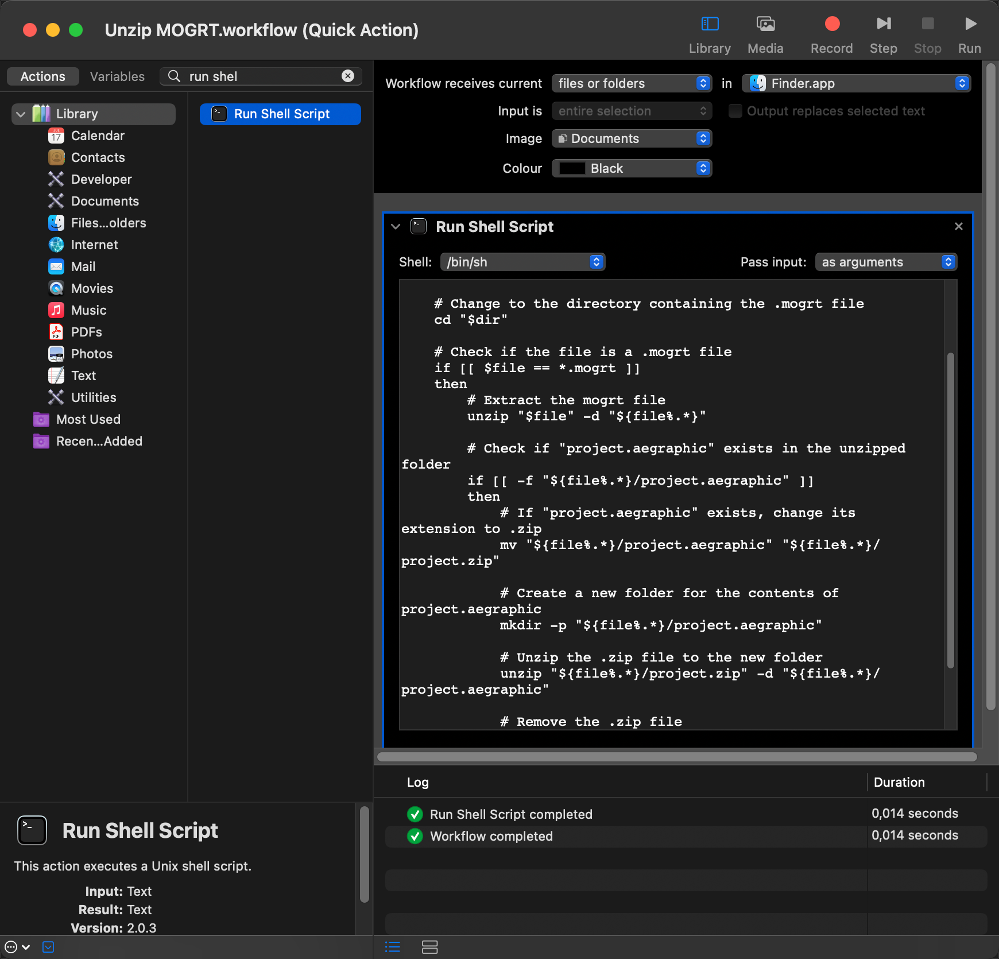

# MOGRT Extractor

MOGRT Extractor is a quick action script for macOS that automates the process of extracting the contents of .mogrt files.
Currently works only with MOGRT files exported from AE.

## Installation

To set up the script as a Quick Action in Automator:

1. Open Automator and create a new Quick Action.
2. Set the workflow to receive current 'files or folders' in 'Finder'.
3. Add the "Run Shell Script" action. Set "Pass input" to 'as arguments'. 
4. Paste the contents of the `mogrt_extractor.sh` script from this repo into the "Run Shell Script" action.
5. Save the Quick Action with a name like "Unzip MOGRT".

## Usage

After the steps above, you can use MOGRT Extractor as **Quick Action:**

- Right-click on a .mogrt file in Finder and select "Unzip MOGRT" from the Quick Actions menu.

## Demo

---
